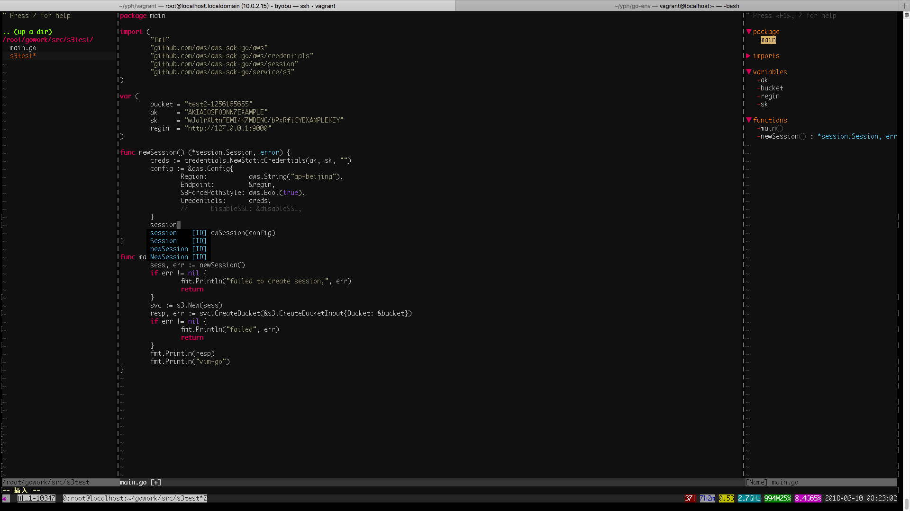
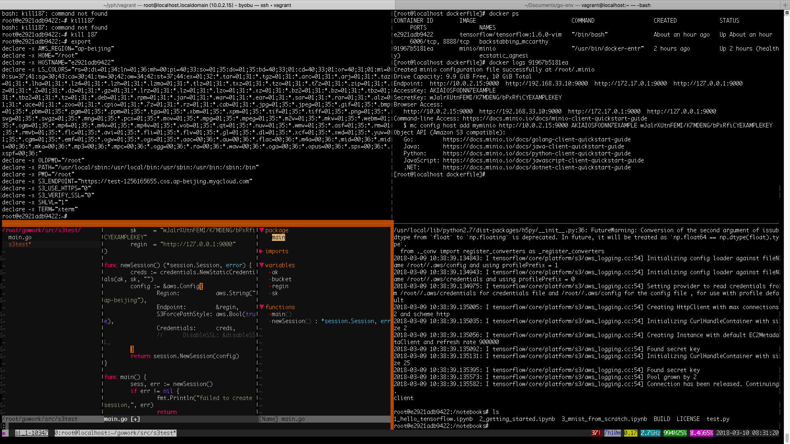

* [go语言开发环境安装使用](#1) 
* [go语言开发环境的使用](#2) 

# go语言开发环境安装使用
> 1、安装virtualBox + vagrant 
> 2、下载 centos-7.0-x86_64-go-env.box 
> 3、创建 vagrant 文件夹 
> 4、cd vagrant 
> 5、将下载的centos-7.0-x86_64-go-env.box 拷贝到vagrant 目录 
> 6、在 vagrant 目录下执行 vagrant init ./centos-7.0-x86_64-go-env.box 命令 
> 7、在vagrant 目录下执行 vagrant up 命令，等待命令执行完毕，执行 vagrant ssh 进入虚拟机，到此go 语言开发环境安装完毕 

# go语言开发环境的使用
> #### 打开vim 的时候发现找不到vim 的时候，执行source /etc/profile 即可； 
> 上面的步骤我们完成了go 的开发环境的安装，接下来 我们来介绍该开发环境的使用 
> 该开发环境 内置了go1.8以及 配置了go 语言vim ,并提供代码跳转、代码自动补全、gotag、netree等功能，提供shell 分屏功能 
> 配置好的vim 环境如下： 
> 
> 配置好的分屏效果如图： 
> 
> 
> vim 相关快捷键： 
> 函数跳转： gd; 
> 回退到上一个函数: ctrl+o; 
> 打开左边框： pp; 
> 打开有边框： ll; 
> 分屏功能相关快捷键： 
> 启动： byobu; 
> 上下分屏： ctrl+b+" ; 
> 左右分屏： ctrl+b+% ; 
> 当前屏幕全屏： ctrl+b+z ; 
> 取消全屏功能： ctrl+b+z ; 
> 选择屏幕： ctrl+b+方向键 ; 